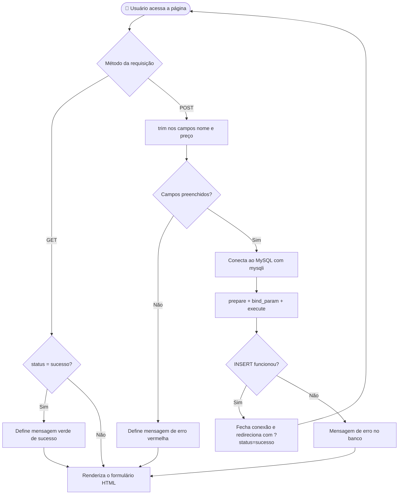
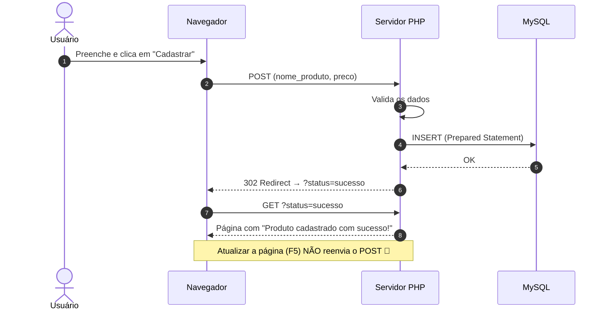

<div align="center">


# 🛒 Cadastro de Produtos com Validação 🛡️

### Atividade 4 · Desafio 2 — Formulário PHP integrado ao MySQL, com validação de dados e proteção contra SQL Injection

<br>


<br>

[📖 Sobre](#-sobre-o-projeto) •
[✨ Funcionalidades](#-funcionalidades) •
[🧰 Tecnologias](#-tecnologias) •
[🗄️ Banco de Dados](#️-banco-de-dados) •
[🚀 Como Executar](#-como-executar) •
[🔍 Como Funciona](#-como-o-código-funciona) •
[🧪 Testes](#-plano-de-testes) •
[🛠️ Problemas Comuns](#️-solução-de-problemas)

</div>

---

## 📖 Sobre o Projeto

Este projeto é a solução do **Desafio 2** da **Atividade 4**: uma página em **PHP** que exibe um formulário de cadastro de produtos, **valida os dados** enviados pelo usuário e, se estiverem corretos, **grava o produto** na tabela `produtos` do banco **MySQL** `exercicio`.

Mais do que "fazer funcionar", a solução foi construída seguindo boas práticas usadas em aplicações reais:

- 🔒 **Prepared Statements** (`mysqli`) para blindar a aplicação contra **SQL Injection**;
- 🧹 **Sanitização** das entradas com `trim()` e do HTML de saída com `htmlspecialchars()`;
- 🔁 Padrão **Post/Redirect/Get (PRG)** para evitar o reenvio duplicado do formulário ao atualizar a página (`F5`);
- 🧱 **Validação em duas camadas**: no navegador (HTML5) e no servidor (PHP);
- 🧭 Código PHP de processamento **antes** de qualquer HTML, permitindo o uso correto de `header()`.

> 💡 **Objetivo de aprendizado:** integrar **front-end (HTML)**, **back-end (PHP)** e **banco de dados (MySQL)** em um fluxo completo de cadastro com validação e segurança.

---

## 🎯 Requisitos da Atividade

| # | Requisito | Status |
|:-:|-----------|:------:|
| 1 | Criar a tabela `produtos` no banco `exercicio` usando o script SQL das instruções | ✅ |
| 2 | Exibir formulário com os campos **Nome do Produto** e **Preço** | ✅ |
| 3 | Validar em PHP que o **nome não está vazio** | ✅ |
| 4 | Validar que o **preço foi informado** (campo obrigatório) | ✅ |
| 5 | Validar que o **preço é um número maior que zero** | ✅ |
| 6 | Dados válidos → inserir no banco e exibir **"Produto cadastrado com sucesso!"** | ✅ |
| 7 | Dados inválidos → exibir mensagem de erro | ✅ |
| 8 | Entregar apenas o arquivo `.php` | ✅ |

---

## ✨ Funcionalidades

- 📝 **Formulário simples e semântico** com `label` associado a cada `input` (acessibilidade).
- ⚡ **Validação instantânea no navegador**: `required`, `type="number"`, `step="0.01"` e `min="0.01"`.
- 🛡️ **Validação no servidor (back-end)**: remove espaços das pontas e confere se os campos foram preenchidos.
- 💾 **Inserção segura** no MySQL com `prepare()` + `bind_param()`.
- ✅ **Mensagem de sucesso** exibida após o redirecionamento (`?status=sucesso`).
- ❌ **Mensagens de erro** em vermelho para campos vazios ou falha no banco.
- 🔄 **Sem reenvio duplicado**: o padrão PRG limpa o POST do histórico do navegador.
- 🔌 **Tratamento de falha de conexão** com o banco de dados.

---

## 🧰 Tecnologias

<div align="center">

| Tecnologia | Papel no projeto |
|:----------:|------------------|
| <br>**PHP** | Lógica de servidor, validação e comunicação com o banco |
| <br>**MySQL** | Armazenamento dos produtos |
| <br>**HTML5** | Estrutura do formulário e validação nativa |
| <br>**XAMPP / Laragon** | Ambiente local (Apache + PHP + MySQL) |

</div>

**Extensões e recursos PHP utilizados:** `mysqli` · `$_POST` / `$_GET` / `$_SERVER` · operador *null coalescing* (`??`) · `trim()` · `empty()` · `htmlspecialchars()` · `header()` · `exit()`

---

## 📁 Estrutura do Projeto

```text
📦 desafio2-cadastro-produtos
 ┣ 📜 10a_desafio2.php   ← Arquivo principal (lógica PHP + formulário HTML)
 ┣ 🗄️ database.sql       ← (Opcional) Script de criação do banco/tabela para testes locais
 ┗ 📘 README.md          ← Você está aqui!
```

> 📌 Conforme a atividade, **apenas o arquivo `.php` é enviado** na entrega. O banco de dados é criado localmente só para testar.

---

## 🗄️ Banco de Dados

### Modelo da tabela `produtos`

| Coluna | Tipo | Restrições | Descrição |
|--------|------|------------|-----------|
| `id` | `INT` | `PRIMARY KEY`, `AUTO_INCREMENT` | Identificador único |
| `nome` | `VARCHAR(100)` | `NOT NULL` | Nome do produto |
| `preco` | `DECIMAL(10,2)` | `NOT NULL` | Preço em reais (2 casas decimais) |

### Script SQL

> ⚠️ Use **o script indicado no arquivo `10a_desafio2.md` da atividade**. O script abaixo é equivalente e compatível com o código, servindo de referência.

```sql
-- 1) Cria o banco de dados (caso ainda não exista)
CREATE DATABASE IF NOT EXISTS exercicio
  CHARACTER SET utf8mb4
  COLLATE utf8mb4_unicode_ci;

-- 2) Seleciona o banco
USE exercicio;

-- 3) Cria a tabela de produtos
CREATE TABLE IF NOT EXISTS produtos (
    id    INT AUTO_INCREMENT PRIMARY KEY,
    nome  VARCHAR(100)  NOT NULL,
    preco DECIMAL(10,2) NOT NULL
);
```

---

## 🚀 Como Executar

### ✅ Pré-requisitos

- **PHP 7.4+** (recomendado 8.x) com a extensão **`mysqli`** habilitada
- **MySQL 5.7+ / 8.x** (ou MariaDB)
- Um ambiente local: **XAMPP**, **Laragon**, **WAMP** — ou o PHP instalado direto na máquina

### 🔧 Passo a passo

**1️⃣ Clone ou baixe o projeto**

```bash
git clone https://github.com/SEU-USUARIO/SEU-REPOSITORIO.git
cd SEU-REPOSITORIO
```

**2️⃣ Crie o banco e a tabela**

Pelo terminal:

```bash
mysql -u root -p < database.sql
```

Ou pelo **phpMyAdmin**: aba **SQL** → cole o script → **Executar**.

**3️⃣ Configure as credenciais de conexão**

No início do arquivo `10a_desafio2.php`, ajuste os dados do **seu** MySQL local:

```php
$servername = "localhost";
$username   = "root";
$password   = "SUA_SENHA_AQUI";   // ← altere para a senha do seu MySQL
$dbname     = "exercicio";
```

**4️⃣ Suba o servidor**

<details>
<summary><b>🟠 Opção A — XAMPP / Laragon / WAMP</b></summary>

1. Copie a pasta do projeto para `htdocs` (XAMPP) ou `www` (Laragon).
2. Inicie os serviços **Apache** e **MySQL**.
3. Acesse: `http://localhost/desafio2-cadastro-produtos/10a_desafio2.php`

</details>

<details>
<summary><b>🟢 Opção B — Servidor embutido do PHP (mais rápido)</b></summary>

Dentro da pasta do projeto, execute:

```bash
php -S localhost:8000
```

Depois acesse: `http://localhost:8000/10a_desafio2.php`

</details>

**5️⃣ Cadastre um produto e confira no banco**

```sql
SELECT * FROM exercicio.produtos ORDER BY id DESC;
```

---

## 🖼️ Pré-visualização

```text
┌────────────────────────────────────────────┐
│  Cadastro de Produtos                      │
│                                            │
│  ✔ Produto cadastrado com sucesso!         │   ← mensagem (verde)
│                                            │
│  Nome do Produto:                          │
│  ┌──────────────────────────────┐          │
│  │ Teclado Mecânico             │          │
│  └──────────────────────────────┘          │
│                                            │
│  Preço:                                    │
│  ┌──────────────────────────────┐          │
│  │ 249.90                       │          │
│  └──────────────────────────────┘          │
│                                            │
│  [ Cadastrar ]                             │
└────────────────────────────────────────────┘
```

> 📸 *Dica: substitua o bloco acima por um print real da sua tela, por exemplo ``.*

---

## 🔍 Como o Código Funciona

### 🔄 Fluxo geral da aplicação



### 🔁 Padrão Post/Redirect/Get (PRG)



### 🧩 Anatomia do arquivo (bloco a bloco)

<details open>
<summary><b>1️⃣ Mensagem de sucesso via GET</b></summary>

```php
$mensagem = "";

if (isset($_GET['status']) && $_GET['status'] === 'sucesso') {
    $mensagem = "<p style='color: darkgreen;'>Produto cadastrado com sucesso!</p>";
}
```

Após o redirecionamento, a página é carregada por **GET** com `?status=sucesso`. É assim que a mensagem aparece sem depender do POST original.

</details>

<details>
<summary><b>2️⃣ Recebimento e limpeza dos dados</b></summary>

```php
if ($_SERVER["REQUEST_METHOD"] === "POST") {
    $nome_produto = trim($_POST["nome_produto"] ?? '');
    $preco        = trim($_POST["preco"] ?? '');
```

- `$_SERVER["REQUEST_METHOD"]` garante que o processamento só ocorra quando o formulário for enviado.
- `??` evita *warnings* caso o campo não exista na requisição.
- `trim()` remove espaços do começo e do fim — evitando cadastros como `"   "`.

</details>

<details>
<summary><b>3️⃣ Validação no back-end</b></summary>

```php
if (!empty($nome_produto) && !empty($preco)) {
    // ... segue para o banco
} else {
    $mensagem = "<p style='color: red;'>Por favor, preencha todos os campos!</p>";
}
```

Mesmo que o usuário desative o JavaScript, altere o HTML pelo DevTools ou envie uma requisição manual, o **servidor continua verificando** os dados. **Nunca confie apenas na validação do navegador.**

</details>

<details>
<summary><b>4️⃣ Conexão e Prepared Statement (segurança)</b></summary>

```php
$conn = new mysqli($servername, $username, $password, $dbname);

if ($conn->connect_error) {
    die("Conexão falhou: " . $conn->connect_error);
}

$stmt = $conn->prepare("INSERT INTO produtos (nome, preco) VALUES (?, ?)");
$stmt->bind_param("sd", $nome_produto, $preco);
```

| Parâmetro | Significado |
|:---------:|-------------|
| `s` | *string* → `$nome_produto` |
| `d` | *double* → `$preco` |

Os `?` são **marcadores de posição**: os valores nunca são concatenados na query, então entradas maliciosas como `'; DROP TABLE produtos; --` são tratadas **apenas como texto**.

</details>

<details>
<summary><b>5️⃣ Execução, redirecionamento e encerramento</b></summary>

```php
if ($stmt->execute()) {
    $stmt->close();
    $conn->close();

    header("Location: " . $_SERVER['PHP_SELF'] . "?status=sucesso");
    exit();
} else {
    $mensagem = "<p style='color: red;'>Erro ao cadastrar no banco de dados.</p>";
}
```

- As conexões são fechadas **antes** do redirecionamento.
- `exit()` logo após o `header()` impede que o restante do script continue rodando.
- O `header()` só funciona porque **nenhum HTML foi enviado antes** — por isso o PHP fica no topo do arquivo.

</details>

<details>
<summary><b>6️⃣ Formulário HTML</b></summary>

```html
<form action="<?php echo htmlspecialchars($_SERVER['PHP_SELF']); ?>" method="post">
    <label for="nome_produto">Nome do Produto: </label><br>
    <input type="text" id="nome_produto" name="nome_produto" required><br><br>

    <label for="preco">Preço: </label><br>
    <input type="number" id="preco" name="preco" step="0.01" min="0.01" required><br><br>

    <button type="submit">Cadastrar</button>
</form>
```

| Atributo | Função |
|----------|--------|
| `htmlspecialchars(...)` | Impede **XSS** ao imprimir `PHP_SELF` no HTML |
| `required` | Impede envio com o campo vazio |
| `type="number"` | Aceita somente números |
| `step="0.01"` | Permite centavos (duas casas decimais) |
| `min="0.01"` | Bloqueia zero e valores negativos no navegador |

</details>

<details>
<summary><b>📄 Código-fonte completo (senha omitida)</b></summary>

```php
<?php
// 1. O código PHP de processamento deve ficar ANTES de qualquer HTML
$mensagem = "";

// Verifica se veio um status de sucesso via requisição GET (após o redirecionamento)
if (isset($_GET['status']) && $_GET['status'] === 'sucesso') {
    $mensagem = "<p style='color: darkgreen;'>Produto cadastrado com sucesso!</p>";
}

// Verifica se o formulário foi enviado via POST
if ($_SERVER["REQUEST_METHOD"] === "POST") {
    // Recebe e limpa espaços vazios nas pontas dos campos
    $nome_produto = trim($_POST["nome_produto"] ?? '');
    $preco = trim($_POST["preco"] ?? '');

    // Valida no back-end se os campos foram preenchidos
    if (!empty($nome_produto) && !empty($preco)) {
        $servername = "localhost";
        $username = "root";
        $password = "SUA_SENHA_AQUI";
        $dbname = "exercicio";

        // Conecta com o banco de dados
        $conn = new mysqli($servername, $username, $password, $dbname);

        // Verifica a conexão
        if ($conn->connect_error) {
            die("Conexão falhou: " . $conn->connect_error);
        }

        // Usa Prepared Statement para prevenir SQL Injection
        $stmt = $conn->prepare("INSERT INTO produtos (nome, preco) VALUES (?, ?)");
        $stmt->bind_param("sd", $nome_produto, $preco);

        if ($stmt->execute()) {
            // Fecha conexões antes de redirecionar
            $stmt->close();
            $conn->close();

            // Redireciona para a mesma página via GET (limpa os dados do POST do navegador)
            header("Location: " . $_SERVER['PHP_SELF'] . "?status=sucesso");
            exit();
        } else {
            $mensagem = "<p style='color: red;'>Erro ao cadastrar no banco de dados.</p>";
        }

        $stmt->close();
        $conn->close();
    } else {
        $mensagem = "<p style='color: red;'>Por favor, preencha todos os campos!</p>";
    }
}
?>
<!DOCTYPE html>
<html lang="pt-br">
<head>
    <meta charset="UTF-8">
    <meta name="viewport" content="width=device-width, initial-scale=1.0">
    <title>Cadastro de Produtos</title>
</head>
<body>

    <h1>Cadastro de Produtos</h1>

    <!-- Exibe a mensagem de retorno (sucesso ou erro) -->
    <?php if (!empty($mensagem)) { echo $mensagem; } ?>

    <form action="<?php echo htmlspecialchars($_SERVER['PHP_SELF']); ?>" method="post">
        <label for="nome_produto">Nome do Produto: </label><br>
        <input type="text" id="nome_produto" name="nome_produto" required><br><br>

        <label for="preco">Preço: </label><br>
        <input type="number" id="preco" name="preco" step="0.01" min="0.01" required><br><br>

        <button type="submit">Cadastrar</button>
    </form>

</body>
</html>
```

</details>

---

## 🛡️ Segurança e Boas Práticas

| Ameaça / Problema | Como o projeto lida com isso |
|-------------------|------------------------------|
| 💉 **SQL Injection** | `prepare()` + `bind_param()` — valores nunca entram na query como texto SQL |
| 🕷️ **XSS** | `htmlspecialchars()` na saída do `PHP_SELF` no atributo `action` |
| 🔁 **Reenvio duplicado (F5)** | Padrão **PRG** com `header("Location: ...")` + `exit()` |
| 🧽 **Espaços inúteis** | `trim()` em todos os campos recebidos |
| 🚫 **Campos vazios** | `required` no HTML + verificação com `empty()` no PHP |
| 🔌 **Banco fora do ar** | Checagem de `$conn->connect_error` |
| 🔐 **Credenciais no código** | ⚠️ Aceitável em exercício local. Em projetos reais, use variáveis de ambiente/arquivo `.env` **fora** do repositório |

> 🔑 **Importante:** nunca publique sua senha real do MySQL no GitHub. Se o repositório for público, mantenha um valor genérico no código versionado.

---

## 🧪 Plano de Testes

| # | Cenário | Nome | Preço | Resultado esperado |
|:-:|---------|------|-------|--------------------|
| 1 | ✅ Cadastro válido | `Caneta Azul` | `3.50` | Redireciona e exibe **"Produto cadastrado com sucesso!"** |
| 2 | ✅ Preço com centavos | `Teclado Mecânico` | `249.90` | Cadastrado com sucesso |
| 3 | ❌ Nome vazio | *(vazio)* | `10` | Navegador bloqueia (`required`); se burlado, servidor exibe erro |
| 4 | ❌ Preço vazio | `Mouse` | *(vazio)* | Navegador bloqueia (`required`); se burlado, servidor exibe erro |
| 5 | ❌ Nome só com espaços | `"   "` | `10` | `trim()` zera o nome → erro de preenchimento |
| 6 | ❌ Preço zero | `Mouse` | `0` | Navegador bloqueia (`min="0.01"`); no servidor, `"0"` conta como vazio → erro |
| 7 | ❌ Preço negativo | `Mouse` | `-5` | Navegador bloqueia (`min="0.01"`) ⚠️ *Veja [Melhorias](#-melhorias-sugeridas) para bloquear também no servidor* |
| 8 | 💉 Tentativa de SQL Injection | `'); DROP TABLE produtos;--` | `10` | Gravado como **texto comum** — a tabela permanece intacta |

### 🔬 Testando o back-end sem o navegador

Para conferir a validação do **servidor** (ignorando as travas do HTML), envie o POST direto pelo terminal:

```bash
curl -i -X POST http://localhost:8000/10a_desafio2.php \
     -d "nome_produto=Teste&preco=-5"
```

---

## 🛠️ Solução de Problemas

<details>
<summary><b>❗ <code>Fatal error: Class "mysqli" not found</code></b></summary>

A extensão `mysqli` não está ativa. No `php.ini`, remova o `;` da linha `extension=mysqli` e reinicie o Apache/PHP.

</details>

<details>
<summary><b>❗ <code>Conexão falhou: Access denied for user 'root'@'localhost'</code></b></summary>

Usuário ou senha incorretos. Confira `$username` e `$password` no início do arquivo e teste as mesmas credenciais no phpMyAdmin.

</details>

<details>
<summary><b>❗ <code>Unknown database 'exercicio'</code></b></summary>

O banco ainda não foi criado. Execute o script SQL da seção [Banco de Dados](#️-banco-de-dados).

</details>

<details>
<summary><b>❗ <code>Table 'exercicio.produtos' doesn't exist</code></b></summary>

O banco existe, mas a tabela não. Rode o `CREATE TABLE` dentro do banco `exercicio`.

</details>

<details>
<summary><b>❗ <code>Warning: Cannot modify header information - headers already sent</code></b></summary>

Algo foi impresso **antes** do `header()` (espaço, linha em branco ou HTML acima do `<?php`). Garanta que o `<?php` seja o **primeiro caractere** do arquivo e que o processamento fique antes do HTML.

</details>

<details>
<summary><b>❗ Os caracteres acentuados aparecem estranhos</b></summary>

Salve o arquivo em **UTF-8** e mantenha `<meta charset="UTF-8">` no HTML. No banco, prefira `utf8mb4`.

</details>

---

## 🔮 Melhorias Sugeridas

Ideias para evoluir o projeto depois de entregue a atividade:

### 1. Validação numérica completa no servidor

Hoje o back-end confere se o preço foi preenchido; o "número maior que zero" é garantido pelo navegador (`min="0.01"`). Para blindar também o servidor — e exibir exatamente a mensagem pedida na atividade — basta trocar o bloco de validação:

```php
$nome_produto = trim($_POST["nome_produto"] ?? '');
$preco        = trim($_POST["preco"] ?? '');

if ($nome_produto === '') {
    $mensagem = "<p style='color: red;'>Erro: O nome do produto não pode ficar vazio.</p>";
} elseif (!is_numeric($preco) || (float) $preco <= 0) {
    $mensagem = "<p style='color: red;'>Erro: O preço deve ser um número positivo.</p>";
} else {
    // ... conexão + prepared statement + redirecionamento
}
```

> 💡 Usar `=== ''` em vez de `empty()` também evita que um nome como `"0"` seja rejeitado por engano.

### 2. Outras evoluções

- [ ] 📋 **Listar** os produtos cadastrados em uma tabela HTML
- [ ] ✏️ **Editar** e 🗑️ **excluir** produtos (CRUD completo)
- [ ] 🎨 **Estilizar** com CSS (ou Bootstrap/Tailwind) e feedback visual mais moderno
- [ ] 🔐 Mover as credenciais para um arquivo de configuração/`.env`
- [ ] 🧾 Formatar o preço em reais com `number_format()`
- [ ] 🛡️ Adicionar **token CSRF** ao formulário
- [ ] 🔄 Migrar de `mysqli` para **PDO**
- [ ] 🧪 Criar testes automatizados com **PHPUnit**

---

## 📚 O Que Foi Praticado

- ✔️ Integração **HTML + PHP + MySQL** em um único fluxo
- ✔️ Métodos **GET** e **POST** e superglobais (`$_GET`, `$_POST`, `$_SERVER`)
- ✔️ **Prepared Statements** com `mysqli`
- ✔️ Validação **front-end** e **back-end**
- ✔️ Padrão **Post/Redirect/Get**
- ✔️ Boas práticas de **segurança** (SQL Injection e XSS)
- ✔️ Organização do código: **lógica antes da apresentação**

---

## 👨‍💻 Autor

<div align="center">

**Vinycius Lopes Monteiro da Silva**
🎓 Turma **1I-IDS**

*Projeto desenvolvido para fins educacionais.*

</div>

---

<div align="center">

### ⭐ Se este projeto te ajudou, deixe uma estrela no repositório!

</div>
